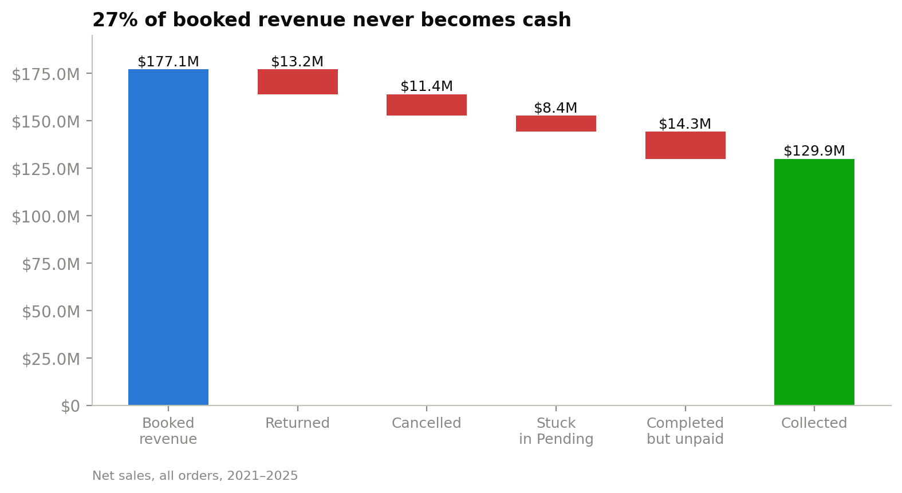
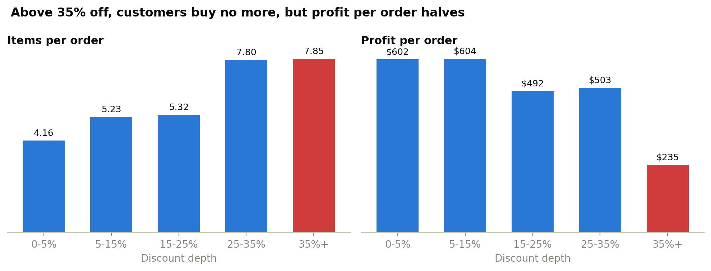
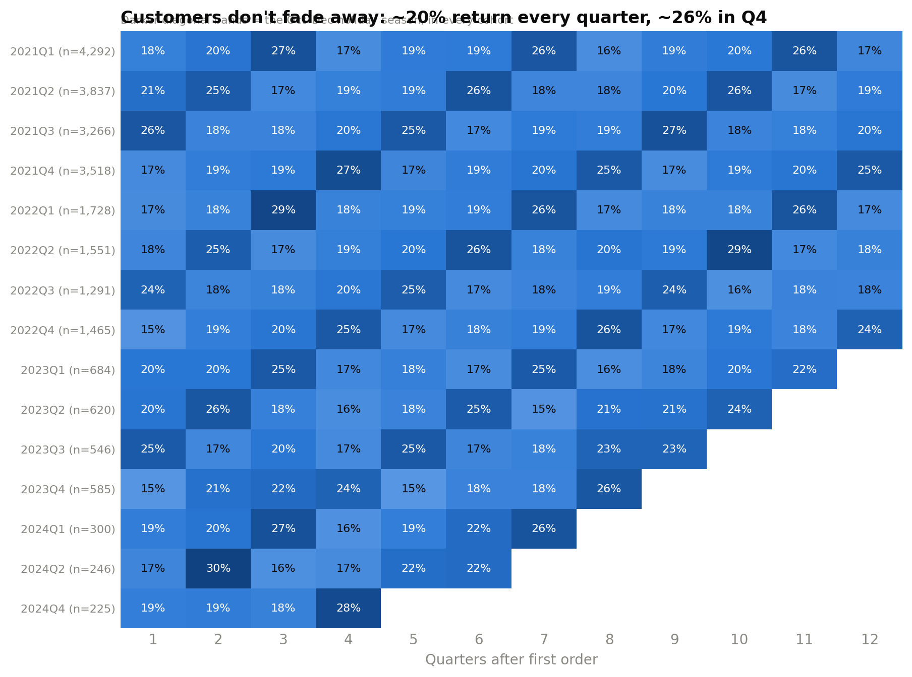
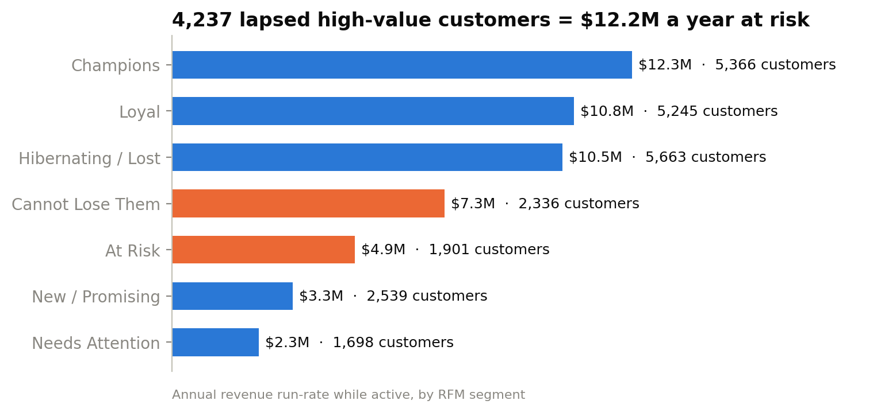

# Where Is the Money Going? Revenue Leakage & Customer Retention Analysis

**Tools:** SQL (SQLite) · Python (pandas, matplotlib) · Power BI
**Data:** 138,116 orders · 397,569 order lines · 24,911 customers · 1,175 products · Jan 2021 – Dec 2025

---

## Executive summary

A multi-country online retailer reports **$177.1M in revenue**. After auditing the data, only **$144.2M** came from completed orders and only **$129.9M** was actually collected. That means **27% of booked revenue never turned into cash.**



Revenue has been flat for five years (≈$28.7M completed per year). It stays flat only because existing customers keep buying: **new customer acquisition fell 97%** (14,913 new customers in 2021 → 399 in 2025).

**Top three actions:**

| # | Recommendation | Estimated impact |
|---|---|---|
| 1 | Chase $14.3M of unpaid "Completed" orders and fix the order-status workflow | Up to **$14.3M** cash recovered; stops ~$2.8M/year of new receivables |
| 2 | Cap discounts at 30%. Above 35% off, customers buy no more but profit per order halves | **+$1.44M profit** over the period (~$290K/year), even if 20% of those orders are lost |
| 3 | Win-back campaign for 4,237 high-value lapsed customers, launched in Sep–Oct ahead of the Q4 peak | ~**$1.2M/year** revenue at a 10% reactivation rate, for ~$106K spend |

---

## 1. Business problem

Leadership wants to know:

1. How much booked revenue is actually turning into cash?
2. Are discounts buying profitable sales, or giving margin away?
3. Which customers matter most, who is slipping away, and what is at risk?
4. Can we trust the data behind our dashboards?

## 2. Data

| File | Rows | Grain |
|---|---|---|
| `ecommerce_sales_customer_analytics_150k.csv` | 138,116 | One row per order (46 columns) |
| `order_items.csv` | 397,569 | One row per product in an order |
| `customer_master.csv` | 25,000 | One row per customer |
| `product_catalog.csv` | 1,175 | One row per product |
| `dataset_statistics.csv` | 1 | Pre-computed headline KPIs |

**Business rules used in this analysis:**
- **Revenue** = `net_sales` of orders with status `Completed`.
- **Collected revenue** = Completed **and** payment status `Paid`.
- **Analysis date** = 2025-12-31, the last date in the data.
- **Lapsed customer** = no completed order in 365+ days. The average gap between repeat orders is 296 days, so this threshold is conservative.

## 3. Data quality audit: what's lacking

Before analysing, I tested whether the data could be trusted (`sql/02_data_quality_audit.sql`).

**What's solid:** every order, order line, customer and product key joins cleanly (0 orphan records), there are no duplicate orders, and no customer attributes conflict between tables.

**Issues found:**

| # | Issue | Evidence | Why it matters |
|---|---|---|---|
| 1 | **Headline revenue is overstated** | `dataset_statistics.csv` reports $177.1M, but that total includes cancelled, returned and pending orders. Completed revenue is $144.2M. | Anyone using the headline figure is overstating revenue by **$32.9M (19%)** and profit by $16.4M |
| 2 | **Order totals don't match their line items** | 11,226 orders (8.1%) have a header quantity/net sales that differs from the sum of their items | Category-level and order-level reports won't reconcile |
| 3 | **Contradictory statuses** | 11,306 orders are "Completed" but payment is still "Pending"; 1,997 are "Pending" yet "Paid"; every Pending order is marked delivery "Cancelled" | The order workflow isn't closing orders out properly (see Finding 1) |
| 4 | **Stored customer metrics are wrong** | `customer_order_count` disagrees with the real order count for 9,424 customers (38%) | Pre-built "CLV" and "repeat customer" fields can't be trusted, so I recalculated them from the transactions |
| 5 | **Currency label with no conversion** | INR orders average 1,352, the same as USD orders | Amounts appear to be already in one currency; the `currency` column is misleading |
| 6 | **Ratings only exist for completed orders** | All 24,557 cancelled/returned/pending orders have no rating | Customer satisfaction looks better than it is: unhappy customers aren't heard |
| 7 | **Coupons don't change discounts** | Orders with and without a coupon both average a 17.4% discount | Coupon tracking is broken, so promotion effectiveness can't be measured |
| 8 | **Marketing attribution shows no signal** | All 10 channels and 17 campaigns have margins within 43.0–43.9% and near-identical AOV; there is no spend data | Marketing ROI **cannot be calculated**, so budget decisions are being made blind |
| 9 | **Stats file errors** | "Total Products Used = 138,116", but the catalog has 1,175 products | Pre-computed summaries shouldn't be trusted without checking them |
| 10 | **Customer acquisition cost looks implausible** | Average CAC is $42 against $5,827 average customer revenue (138:1) | Probably excludes most marketing costs; payback analysis isn't reliable |
| 11 | **"Revenue" includes tax and shipping** | `net_sales = gross − discount + tax + shipping` on 100% of rows; $16.3M of completed revenue is tax and shipping | Revenue and margin are overstated. Report revenue excluding tax and shipping |

**Data the business should start collecting:** marketing spend by channel and campaign, website sessions and funnel events (for conversion rates), customer sign-up dates, inventory and stock-outs, and a post-return or post-cancellation survey.

> **Note on the dataset:** this is a synthetic dataset. Names, cities and product names are generated, and some dimensions (warehouses, return reasons, channels) are almost perfectly uniform. I report where the data shows **no signal** rather than inventing one. Treating "no difference" as a finding is part of the analysis.

## 4. Key findings

### Finding 1: 27% of booked revenue never becomes cash
*(`sql/03_revenue_leakage.sql`)*

| Where it goes | Orders | Net sales |
|---|---|---|
| ✅ Completed & paid (collected) | 102,253 | **$129.9M** |
| ⚠️ Completed but **never paid** | 11,306 | $14.3M |
| ↩️ Returned & refunded | 9,462 | $13.2M |
| ❌ Cancelled (payment failed) | 8,398 | $11.4M |
| ⏸️ Stuck in "Pending" | 6,697 | $8.4M |

- Unpaid "Completed" orders add up at **~$2.8M every year, including $2.8M from 2021**. Those receivables are four years old and probably uncollectable without action.
- **1,997 customers paid for orders that are still "Pending"** ($2.5M). These customers paid but never received anything, which is a complaint and chargeback risk.
- Returns are spread evenly across reasons, with no single reason above ~13%. "Late Delivery" alone accounts for 1,172 returns ($1.65M).

### Finding 2: Deep discounts are destroying margin

| Discount depth | Orders | Avg margin | Loss-making orders |
|---|---|---|---|
| 0–5% | 9,652 | 52.5% | 0 |
| 5–15% | 50,450 | 49.1% | 0 |
| 15–25% | 29,412 | 43.8% | 0 |
| 25–35% | 12,536 | 36.2% | 0 |
| **35%+** | **11,509** | **20.7%** | **1,229** |

- **Every one of the 1,229 loss-making orders has a discount above 35%** (their average is 52%). Below 35%, no order loses money.
- **Up to 35% off, deeper discounts do grow the basket** (5.2 → 7.8 items). **Beyond 35%, basket size stays flat (7.80 vs 7.85 items) while profit per order halves ($503 → $235).** Discounts also don't buy loyalty: ~60% of customers buy again within a year, whatever discount they got first. *(Python notebook, section 3)*



- **Electronics** is the largest category ($33.5M) and also the lowest-margin one (32.6%), with the highest share of loss-making lines (4.4%).

### Finding 3: One in seven deliveries is late, and it's systemic

- 15% of completed orders arrive late. Late orders are rated **3.22★**, against 3.73★ on time and 4.02★ early. The −0.50★ gap is statistically significant (Welch's t-test, p < 0.001, 95% CI −0.51 to −0.49).
- The delay rate is the same across all 19 warehouses (14.1–15.8%) and all shipping methods. **Customers paying for Express are delayed just as often as Economy (15.0% vs 14.9%).**
- So the problem is in the process (carrier SLAs, cut-off times), not one bad warehouse.
- *Honest caveat:* late delivery lowers ratings, but in this data it does **not** reduce the 12-month reorder rate (60.1% vs 60.0%). The main risk is reputational (reviews, marketplace ranking) rather than churn.

### Finding 4: The business is living off its existing customer base

| First-order year | 2021 | 2022 | 2023 | 2024 | 2025 |
|---|---|---|---|---|---|
| New customers | 14,913 | 6,035 | 2,435 | 966 | 399 |

- New customer acquisition has fallen 97% while revenue stayed flat. Existing customers carry the business, which makes retention the top priority.
- **40% of customers (9,819) have not bought in over a year.**
- The top 10% of customers generate 22.9% of revenue, and the top 30% generate 53%.
- **Customers are seasonal, not disloyal.** In every cohort, ~20% of customers buy again each quarter, with no decay even three years in, and ~26% in Q4. **Q4 brings in 34% of yearly revenue.**



### Finding 5: Customer segments (RFM)
*(`sql/05_customer_retention_rfm.sql`)*

Customers are scored 1–5 on **R**ecency, **F**requency and **M**onetary value:

| Segment | Customers | Avg days since last order | Lifetime revenue | Annual revenue run-rate | Action |
|---|---|---|---|---|---|
| Champions | 5,366 | 70 | $48.3M | $12.3M | Reward, referral program, early access |
| Loyal | 5,245 | 191 | $35.8M | $10.8M | Upsell, loyalty tiers |
| **Cannot Lose Them** | **2,336** | **548** | **$19.8M** | **$7.3M** | **Personal win-back** |
| Hibernating / Lost | 5,663 | 793 | $16.4M | $10.5M | Low-cost automated emails only |
| **At Risk** | **1,901** | **630** | **$10.7M** | **$4.9M** | **Targeted win-back offer** |
| New / Promising | 2,539 | 77 | $8.0M | $3.3M | Onboarding, second-purchase nudge |
| Needs Attention | 1,698 | 265 | $5.3M | $2.3M | Re-engagement email |

**"Cannot Lose Them" + "At Risk" = 4,237 formerly strong customers, worth $12.2M a year when they were active.**



## 5. Recommendations

| Priority | Recommendation | Owner | Estimated impact | Assumptions |
|---|---|---|---|---|
| 🔴 1 | **Fix order-to-cash.** Chase $14.3M in unpaid completed orders, refund or fulfil 1,997 paid-but-pending orders, auto-cancel orders pending for more than 30 days | Finance + Ops | Up to $14.3M cash; ~$2.8M/year of new receivables avoided | Oldest receivables may be uncollectable |
| 🔴 2 | **Cap discounts at 30%** and require approval above that | Pricing / Marketing | **+$1.44M profit** over 5 years (+27% profit on affected orders) | 20% of affected orders are lost to the cap. This is conservative: discounts above 35% don't increase basket size |
| 🟠 3 | **Win-back campaign** for 4,237 "Cannot Lose Them" + "At Risk" customers, **launched in Sep–Oct** before the Q4 peak. Use a non-discount incentive (discounts don't buy loyalty) | CRM | ~$1.2M/year revenue (~$500K profit) | 10% reactivation, $25 incentive each (~$106K cost) |
| 🟠 4 | **Renegotiate carrier SLAs** and stop charging an Express premium that delivers no faster | Logistics | Higher ratings (+0.5★ on affected orders); fewer "Late Delivery" returns ($1.65M) | Delays are carrier-driven, since they're uniform across warehouses |
| 🟡 5 | **Restart customer acquisition.** Only 399 new customers in 2025 | Marketing | Protects the long-term revenue base | Requires spend data (see #6) |
| 🟡 6 | **Fix the data.** Track marketing spend, report revenue excluding tax and shipping, fix coupon logging, reconcile order headers with line items, recompute CLV from transactions | Data / BI | Makes marketing ROI measurable | — |

## 6. Power BI dashboard

A 4-page dashboard built on a star schema. The full build steps, all DAX measures and checkpoint values are in [`powerbi/POWERBI_GUIDE.md`](powerbi/POWERBI_GUIDE.md).

| Page | Headline it answers |
|---|---|
| 1. Executive Overview | 27% of booked revenue never becomes cash; new customers down 97% |
| 2. Revenue Leakage & Operations | $2.8M/year of "completed" orders go unpaid; Express is as late as Economy |
| 3. Profitability & Discounts | Discounts above 35% cut margin to 21% and cause every loss-making order |
| 4. Customers & Retention | 4,237 lapsed high-value customers = $12.2M a year at risk, plus a win-back target list |

**Data model:** `dim_date` and `dim_customers` → `fact_orders` → `fact_order_items` (the tables are in `dashboard_data/`, generated by `sql/06_dashboard_exports.sql`). The waterfall's stage labels come from `revenue_waterfall.csv`, while its values come from a DAX measure, so the chart responds to slicers.

The page layouts, chart choices and field mappings were planned first in a design blueprint ([`powerbi/dashboard_blueprint.html`](powerbi/dashboard_blueprint.html); download it and open it in a browser).

*Screenshots of the finished Power BI report: coming soon (`powerbi/screenshots/`).*

## 7. Limitations

- Synthetic dataset: patterns such as uniform warehouse delay rates may not hold in real data.
- Impact estimates are directional and based on the stated assumptions. A real rollout should be A/B tested.
- 8.1% of orders don't reconcile with their line items. Order-level figures use the order table and category figures use the line items.
- The fall in new customers is partly structural: the customer base is a fixed pool of 25,000, so first orders cluster in the early years. A sign-up date field would confirm this.

## 8. How to run

**SQL** (needs only `sqlite3`, preinstalled on macOS and most Linux):

```bash
./run_all.sh
```

This rebuilds `ecommerce.db` from `data/`, writes query results to `outputs/`, and exports dashboard tables to `dashboard_data/`.

**Python** (the notebook reads the tables that `run_all.sh` produces):

```bash
python3 -m venv .venv && .venv/bin/pip install -r requirements.txt
.venv/bin/python python/build_notebook.py
cd notebooks && ../.venv/bin/jupyter nbconvert --to notebook --execute --inplace analysis.ipynb
```

The notebook source lives in `python/build_notebook.py`, so changes show up cleanly in git. Charts are saved to `outputs/charts/`.

## Project structure

```
├── data/                  raw CSVs (unchanged)
├── sql/
│   ├── 01_load_data.sql
│   ├── 02_data_quality_audit.sql
│   ├── 03_revenue_leakage.sql
│   ├── 04_discounts_and_margin.sql
│   ├── 05_customer_retention_rfm.sql
│   └── 06_dashboard_exports.sql
├── python/build_notebook.py   source for the analysis notebook
├── notebooks/analysis.ipynb   Python analysis: discount effect, t-test, cohorts, charts
├── outputs/               query results (.txt) and charts (charts/*.png)
├── dashboard_data/        clean star-schema tables for Power BI
├── powerbi/               build guide, design blueprint, theme
├── requirements.txt
└── run_all.sh
```
